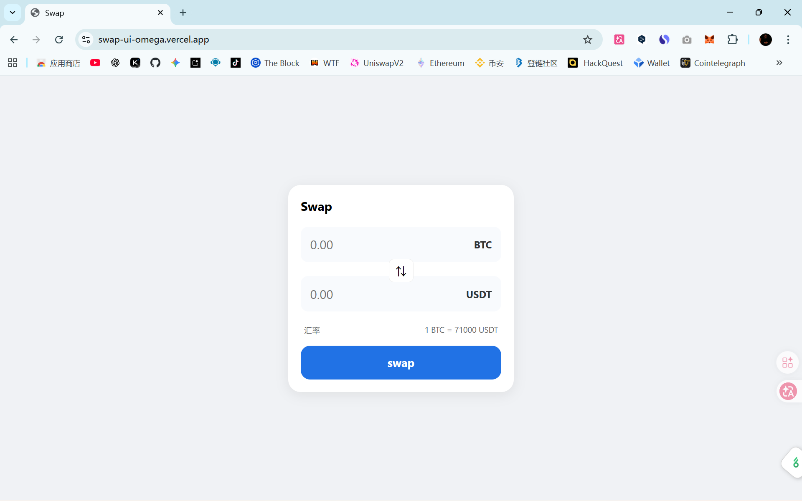

# 简易SWAP计算器

## 项目介绍

这是一个简易的swap交易计算器,基于web前端基础技术实现,用户能通过输入tokenA的数量,看到预估兑换的tokenB的数量,进行兑换

## 页面

## swap UI实现逻辑

- 监听输入框 `oninput` 事件,然后根据汇率自动计算
- 点击切换按钮能实现兑换方向反转

## 使用的技术

html5作为骨架的搭建,然后css利用flex布局装饰页面,js负责处理逻辑

## 部署地址

https://swap-ui-omega.vercel.app/