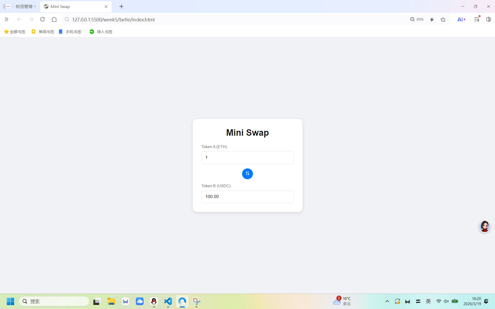

# Mini Swap UI

## 项目介绍
一个简单的 Swap 页面，实现 Token A 与 Token B 的兑换计算和方向切换功能。

## 页面截图

## Swap UI 实现逻辑
1.  **HTML**：搭建页面结构，包含标题、两个输入框和一个 Swap 按钮
2.  **CSS**：使用 Flex 布局实现响应式页面样式
3.  **JavaScript**：
    - 监听输入框变化，自动计算 Token B 数量
    - 点击按钮切换兑换方向，更新标签和计算逻辑

## 使用的技术
- HTML5
- CSS3 (Flex 布局)
- JavaScript (DOM 操作、事件监听)

## 部署地址
https://belle-k.github.io/baby-dev/week5/belle/index.html

